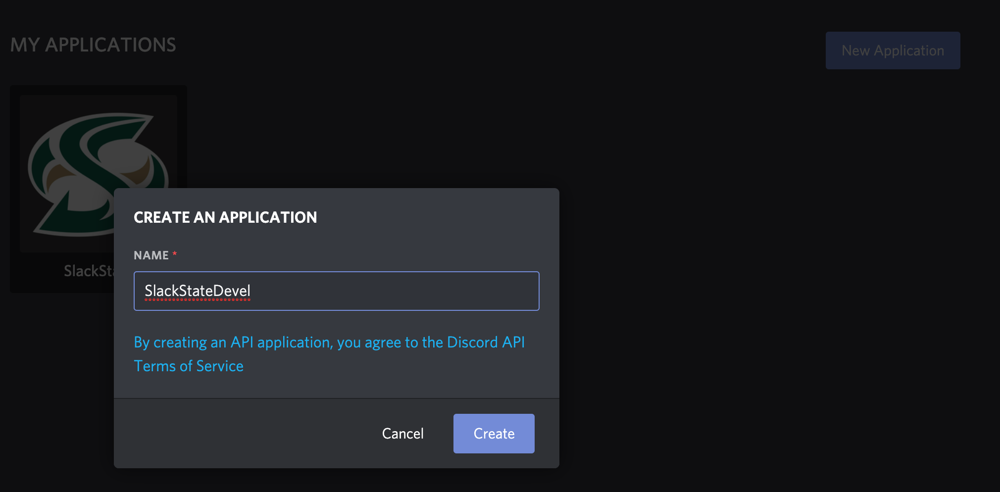
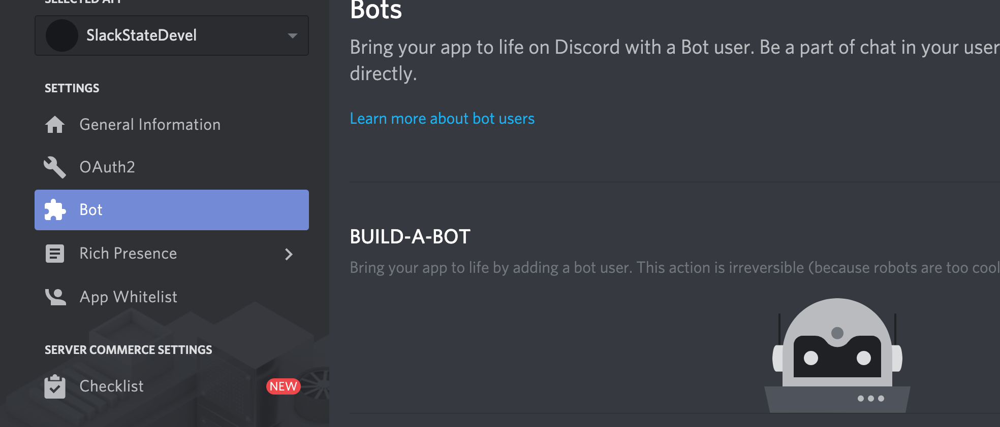
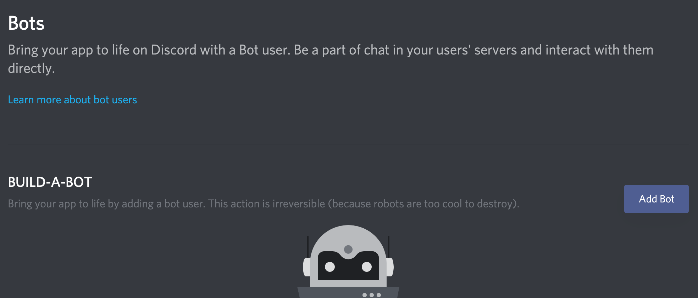
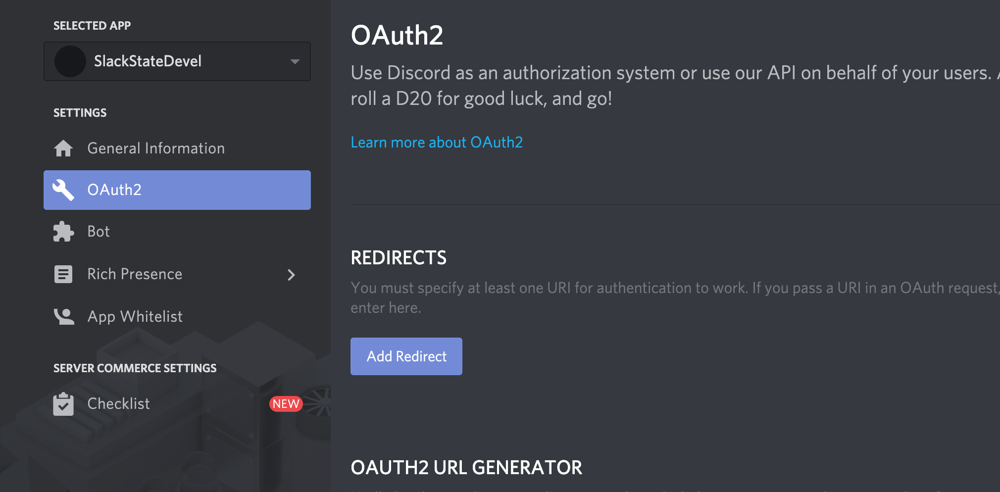
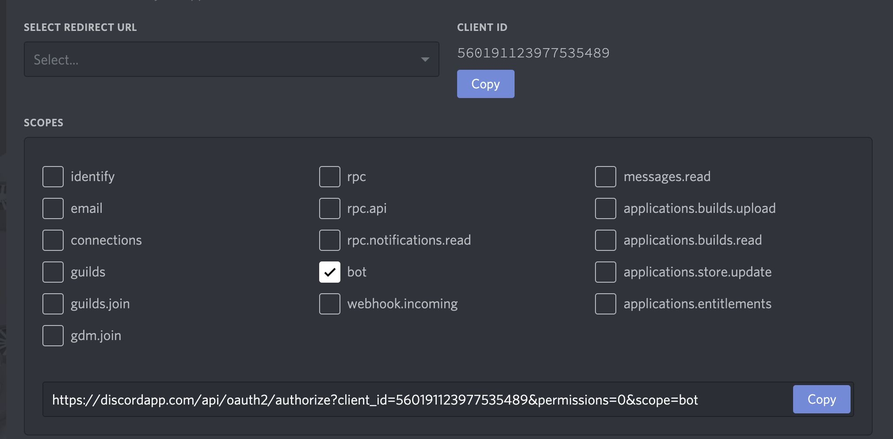
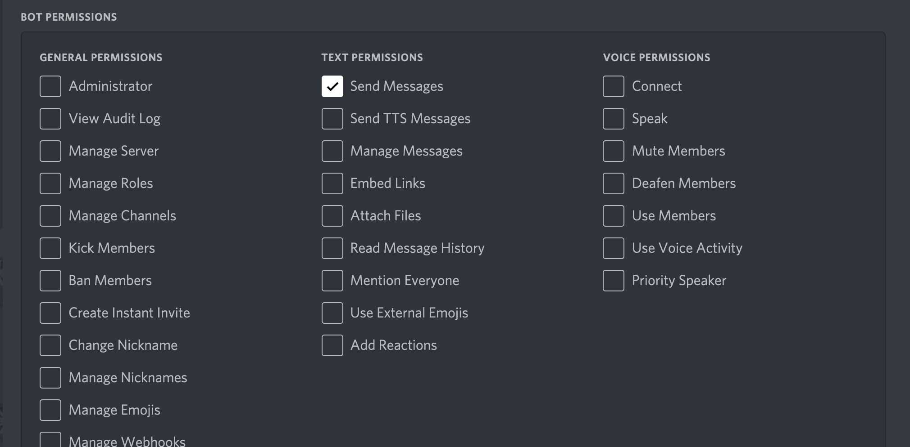
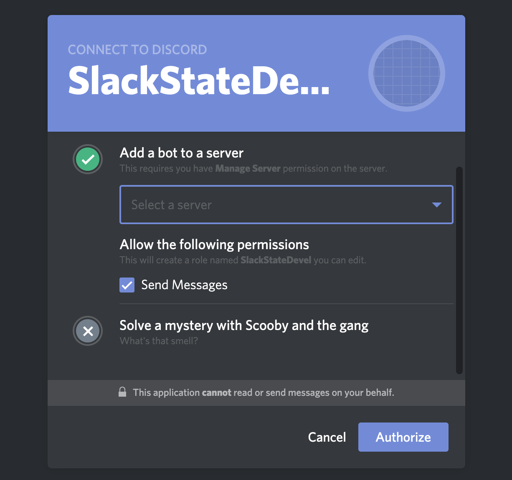
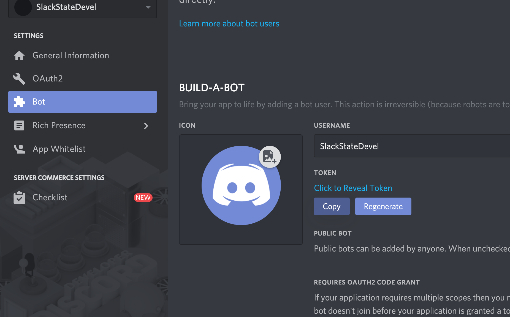

# SlackState Discord Bot

The purpose of this bot is to mess around, have fun, and learn how to do web
stuff.

Please feel free to contribute whatever silly (or serious) features you want.

_If you get stuck, feel free to ask `@white_jeezus#7233` for help._

# Adding the bot to your server

If you would like to add the official `SlackState` bot to your server, click
[here][SlackState], select your server from the dropdown, and click `Authorize`.

There is only one "official" `SlackState` bot, but you can create your own. The
official bot is hosted on [Heroku]. If you want to host your own version, follow
the steps below to create a Discord bot, and link your server to that bot. Note
that you can call your bot whatever you want.

# Installing node.js

## MacOS

### Homebrew

If you do not have homebrew installed, you probably should. It is the easiest
way to install most programs on MacOS, especially for a programmer. If you do
not have it, follow [this link][homebrew] and install it. It's extremely simple
to install.

Once you have homebrew, to install node:

```
$ brew install node
```

## Windows

[Install node][nodejs] (This also works for MacOS if you don't want to use
homebrew).

## Linux

### Arch

```
$ pacman -S nodejs npm
```

### Debian (including Ubuntu)

```
$ sudo apt install nodejs
```

### Fedora (RedHat, CentOS, OpenSUSE)

```
$ sudo yum install nodejs
```

# Setting up a Discord bot

Create a folder for the project, and clone the project into it.

```
$ git clone https://github.com/sacramento-state-web-development-club/slackstate.git
```

To create your own bot for development, go to
[the Discord developer portal][discord-developer-portal], and create a new app.



You can call it whatever you want, and click `Create`.

Then go to `Bot` on the left



Click `Add Bot`



And click `Yes, do it!`

Then click `OAuth2` in the sidebar



Scroll down and click `bot`



Scroll further and click `Send Messages` (depending on what changes you want to
make, you might want to enable more privelidges).



Then click the blue `Copy` button, and paste that link in your browser.



If you don't have your own discord server, you will need to create one. It's not
hard, google it or ask for help if you get stuck.

Bots on Discord are kind of like users. If you want to control it,
you have to log in. Discord gives you a token which you can use to log in to
your bot.

You can find your bot's token in the `Bot` tab. Click the blue `Copy` button to
copy it.



You will need to create a file called `tokenfile` (no extension) in the root of
the project. That file will be ignored by git, and will stay private to you.
Paste your bot's token into `tokenfile`.

# Running your bot

Before you can run, you need to install dependencies.
```
$ npm i
```

Then to run:

```
node bot.js
```

But I highly recommend `nodemon`. `nodemon` will watch your project for changes,
and when you save your files it will automatically restart the server. This is
extremely helpful, because otherwise you will need to manually stop the server
with `Ctrl-C` and then run `node bot.js` every time you make a change.

To install `nodemon`:

```
$ npm i -g nodemon
```

To run your project with `nodemon`:

```
$ nodemon
```

# Hosting

This bot is currently hosted on [Heroku]. When you push code to GitHub, Heroku
will automatically pull your code, and the official [SlackState] bot will update
to your new version.

[discord-developer-portal]: https://discordapp.com/developers/applications/

[homebrew]: https://brew.sh/
[nodejs]: https://nodejs.org/en/
[Heroku]: https://heroku.com/
[SlackState]: https://discordapp.com/api/oauth2/authorize?client_id=559997859718627328&permissions=2048&scope=bot